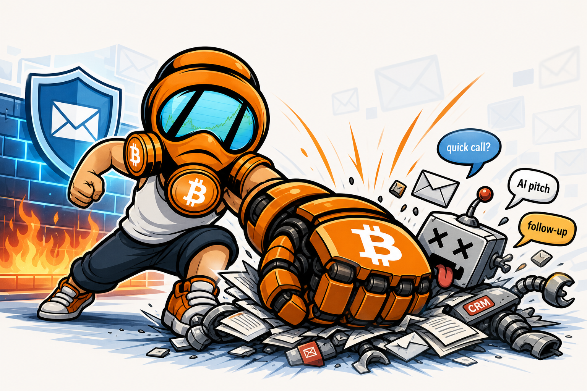

# BotFucker

<p align="center">
  
</p>


BotFucker is a small Python automation project for filtering unsolicited sales outreach, generic AI-generated pitches, and repeated CRM follow-ups from an IMAP mailbox.

The project is intentionally simple: standard-library Python, readable regex rules, a local domain blacklist, and a whitelist for people or domains that should never be filtered.


## BotFucker v2 Direction

The current script is a proof-of-concept. The planned v2 is an AI-assisted inbox defense and consent-enforcement workflow with human approval, sender history, strike levels, and n8n/webhook integration.

See [DESIGN.md](DESIGN.md) for the proposed architecture.

## What It Does

- Connects to an IMAP inbox.
- Scans unread messages from the last 24 hours.
- Detects common cold outreach phrases like "quick call", "scale your business", and "wondering if you saw my last".
- Looks for generic AI-pitch markers such as overly formal structure, vague value propositions, and missing personal references.
- Sends one professional notice of non-consent to flagged senders.
- Moves flagged messages to `Junk/Sales`.
- Adds the sender domain to a local blacklist.
- Deletes future unread messages from blacklisted domains without replying.
- Skips all whitelisted contacts and domains.

## Safety First

The script runs in dry-run mode by default.

Dry-run mode logs what it would do, but does not:

- send replies
- move email
- delete email
- update `blacklist.txt`

Use `--live` only after testing the filters on your own mailbox.

## Requirements

- Python 3.10 or newer
- An email account with IMAP enabled
- SMTP access for sending replies
- An app password if your provider requires one

No third-party Python packages are required.

## Setup

Clone the repo:

```bash
git clone https://github.com/Jdelg718/BotFucker.git
cd BotFucker
```

Create a local blacklist file:

```bash
cp blacklist.example.txt blacklist.txt
```

Configure environment variables.

Linux/macOS:

```bash
export BF_IMAP_HOST="imap.example.com"
export BF_IMAP_PORT="993"
export BF_SMTP_HOST="smtp.example.com"
export BF_SMTP_PORT="465"
export BF_EMAIL_ADDRESS="you@example.com"
export BF_EMAIL_PASSWORD="your-app-password"
export BF_WHITELIST_DOMAINS="yourcompany.com,trustedpartner.com"
export BF_WHITELIST_CONTACTS="person@example.com,client@example.com"
```

PowerShell:

```powershell
$env:BF_IMAP_HOST="imap.example.com"
$env:BF_IMAP_PORT="993"
$env:BF_SMTP_HOST="smtp.example.com"
$env:BF_SMTP_PORT="465"
$env:BF_EMAIL_ADDRESS="you@example.com"
$env:BF_EMAIL_PASSWORD="your-app-password"
$env:BF_WHITELIST_DOMAINS="yourcompany.com,trustedpartner.com"
$env:BF_WHITELIST_CONTACTS="person@example.com,client@example.com"
```

Optional settings:

```bash
export BF_INBOX_FOLDER="INBOX"
export BF_SALES_FOLDER="Junk/Sales"
export BF_BLACKLIST_FILE="blacklist.txt"
```

## Common Provider Settings

Gmail:

```text
BF_IMAP_HOST=imap.gmail.com
BF_SMTP_HOST=smtp.gmail.com
```

Outlook / Microsoft 365:

```text
BF_IMAP_HOST=outlook.office365.com
BF_SMTP_HOST=smtp.office365.com
```

Yahoo:

```text
BF_IMAP_HOST=imap.mail.yahoo.com
BF_SMTP_HOST=smtp.mail.yahoo.com
```

## Test Before Going Live

Compile-check the script:

```bash
python -m py_compile outreach_filter.py
```

Run a dry scan:

```bash
python outreach_filter.py
```

Run live only after reviewing the dry-run output:

```bash
python outreach_filter.py --live
```

## Scheduling

Run every 15 minutes with cron:

```cron
*/15 * * * * cd /path/to/BotFucker && /usr/bin/python3 outreach_filter.py --live >> outreach_filter.log 2>&1
```

For Windows Task Scheduler, use:

```text
Program: python
Arguments: C:\path\to\BotFucker\outreach_filter.py --live
```

## Tuning The Filters

The filter lists live near the top of `outreach_filter.py`:

- `COLD_OUTREACH_PATTERNS`
- `AI_SIGNATURE_PATTERNS`

Good filter ideas should be specific enough to catch bot-like outreach without catching real clients, coworkers, support threads, invoices, or personal messages.

## Contributing

Ideas are welcome. Useful contributions include:

- new cold outreach patterns
- better false-positive protections
- provider-specific IMAP folder handling
- safer dry-run reporting
- lightweight NLP experiments
- tests with anonymized sample emails
- documentation for more email providers

Please do not commit real emails, private contact lists, passwords, tokens, or production blacklist data.

## Disclaimer

Email rules vary by provider and jurisdiction. Test carefully, keep a whitelist, and make sure any automated reply behavior is appropriate for your use case.
